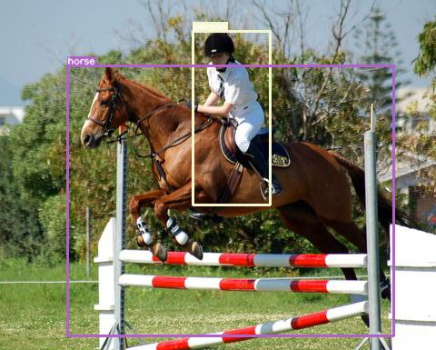
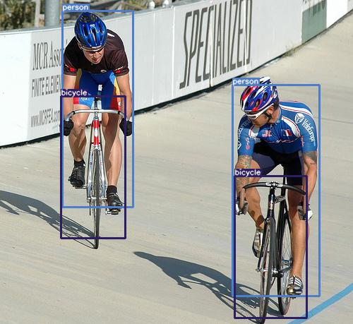
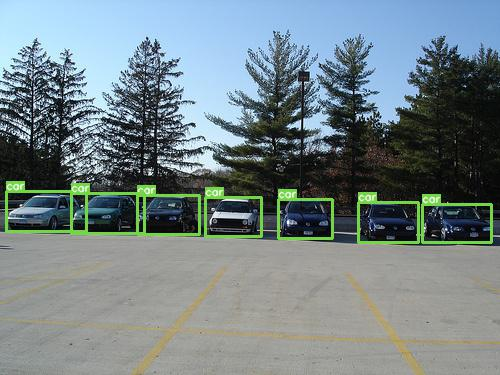

## yolov3.pytorch

> 本仓库为在已有的优秀的yolvo3的实现上，为方便自己使用修改得到。目前只是一个很初级的版本，性能尚有不足，后续将持续改进。

<div align=center></div>

## 数据集

### Pascal VOC data
按照如下的方式下载Pascal VOC数据集：

在任意位置（如`mydata`），执行如下语句：
```shell script
wget https://pjreddie.com/media/files/VOCtrainval_11-May-2012.tar
wget https://pjreddie.com/media/files/VOCtrainval_06-Nov-2007.tar
wget https://pjreddie.com/media/files/VOCtest_06-Nov-2007.tar
tar xf VOCtrainval_11-May-2012.tar
tar xf VOCtrainval_06-Nov-2007.tar
tar xf VOCtest_06-Nov-2007.tar
```
接着，在`mydata`目录下，执行：
```shell script
mkdir voc
cp VOCdevit/VOC2007/JPEGImages ./voc/
cp VOCdevit/VOC2007/Annotations ./voc/
cp VOCdevit/VOC2012/JPEGImages/* ./voc/JPEGImages/
cp VOCdevit/VOC2012/Annotations/* ./voc/Annotations/

mkdir ./voc/ImageSets
mkdir ./voc/ImageSets/Main

cat VOCdevit/VOC2007/ImageSets/Main/train.txt VOCdevit/VOC2007/ImageSets/Main/val.txt VOCdevit/VOC2012/ImageSets/Main/train.txt VOCdevit/VOC2012/ImageSets/Main/val.txt > ./voc/ImageSets/Main/train.txt
cp VOCdevit/VOC2007/ImageSets/Main/test.txt voc/ImageSets/Main/

rm -r VOCdevit
```
接着，进入项目根目录（`mydata`即为上述数据集的下载根目录），执行：
```shell script
mkdir data
ln mydata/voc ./data/
```
在项目根目录下执行：
```shell script
python scripts/prepare_voc.py
```
执行完成后，将在`./data/voc`目录下生成三个文件夹：
```shell script
train: 存放训练图片
train_txt: 存放各个图片所对应的标注文件
categories_id_to_name.json: 类别id到名称的转换文件
```
## 训练
#### 下载预训练权重
```shell script
cd checkpoints/official_weights
wget https://pjreddie.com/media/files/darknet53.conv.74
```
#### 开始训练
> 本项目目前只支持单GPU训练

在项目根目录下执行：
```shell
python train.py

# 如果设备上有多台GPU，请使用下述语句
CUDA_VISIBLE_DEVICES=0 python train.py
```
在训练过程中，中间文件将被保存在`./checkpoints/backup`下的文件夹内，例如`checkpoints/backup/log-2020-06-02T10-32-09`。
#### Tensorboard
进入`checkpoints/backup/log-2020-06-02T10-32-09`下的`tensorboard`目录，执行：
```shell
tensorboard --logdir=./
```
## 测试
训练完成后，使用`test.py`文件进行测试。将`test.py`文件中的权重路径修改为待测试的`.pth`的路径，如：
```python
weight_path = "checkpoints/backup/log-2020-06-02T10-32-09/weights/yolov3_79.pth"
```
在项目根目录下执行：
```shell
python test.py

# 如果设备上有多台GPU，请使用下述语句
CUDA_VISIBLE_DEVICES=0 python test.py
```
## 检测
结果可视化使用的程序文件为`detect.py`文件。
* 请确保该文件中的网络结构配置文件、权重文件等文件相互匹配。

* 将待测试图片放在`data/test_images`下。

* 在根目录下执行：

  ```python
  python detect.py
  ```

检测结果将被存放在`data/test_results`文件夹内。结果如下：

<div align=center></div>

<div align=center></div>

## 自定义参数

本工程的所有的超参数管理均由`config.json`一个文件完成，提供如下的功能：

* 学习率、epoch等基础参数修改；
* 提供多种学习率衰减策略；
* 提供多种优化算法（SGD、Adam等）；
* 多尺度训练；
* Mosaic数据增强（测试中）；
* 左右翻转、上下翻转等普通的数据增强（测试中）；
* GIoU边框回归损失（测试中）。

## 待完成

- [ ] mosaic数据增强；
- [ ] voc数据集上的性能较低，待提升；
- [ ] 网络结构轻量化，包括剪枝、量化、知识蒸馏等；
- [ ] Jetson Nano部署。

## 注意事项

* 在使用Mosaic和训练集数据增强时，如果使用SGD优化器，学习率最高只能是1e-4，否则会导致训练不稳定；但如果使用Adam，则学习率可以调整为1e-3。

## 参考

在编写本项目中，参考了如下两个优秀的项目实现：

* [eriklindernoren/PyTorch-YOLOv3](https://github.com/eriklindernoren/PyTorch-YOLOv3)
* [ultralytics/yolov3](https://github.com/ultralytics/yolov3)

## 后记

调了好久了，卡在一个点上不动，目前还没有找出问题。还望能找出问题的大佬和我交流一下。